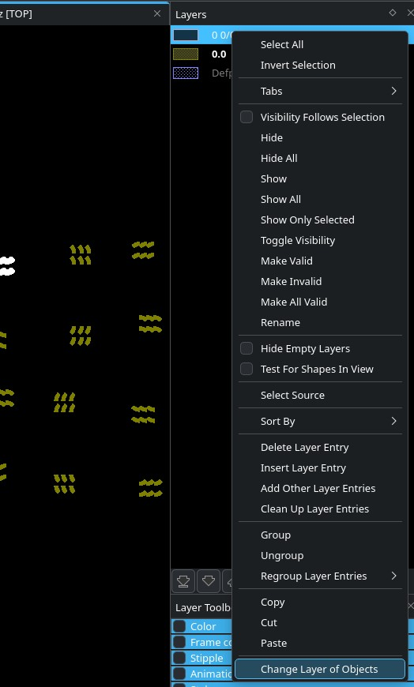

layers_content_toolbox
======================

Package for [KLayout](https://www.klayout.de) adding two items to the right-click menu in the "Layers" pane:

- `Make All Valid`: Makes all layers valid (interactable) and visible. Adds hotkey Ctrl+Shift+V.
- `Change Layer for Objects`: Same as `Edit -> Selection -> Change Layer`

Repository locations
====================

- Primary: https://mpxd.net/code/jan/layers_context_toolbox
- GitHub: https://github.com/anewusername/layers_context_toolbox
